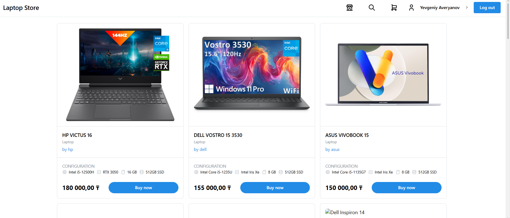
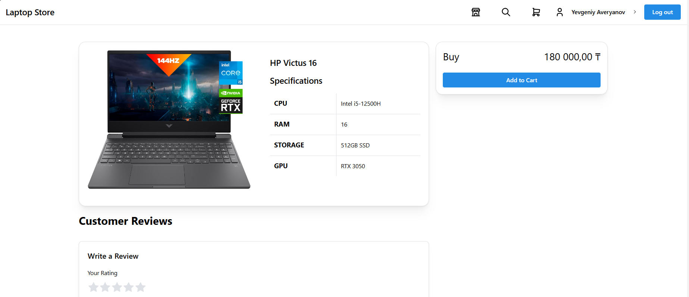
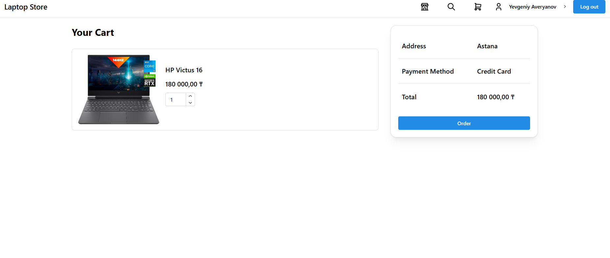
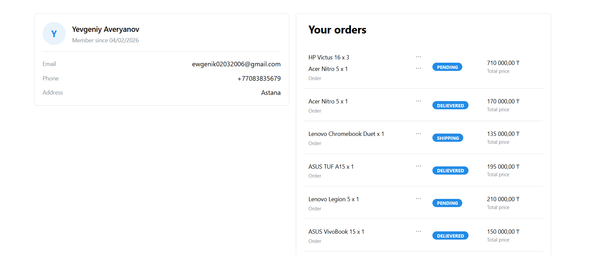
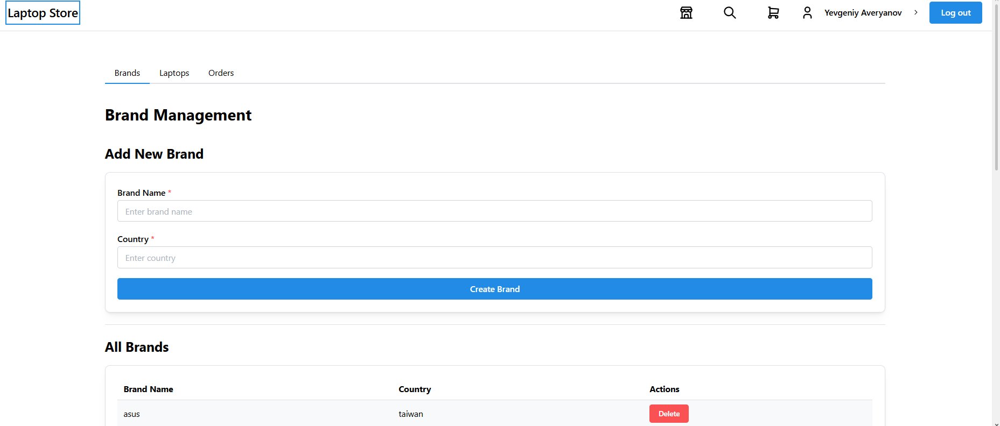
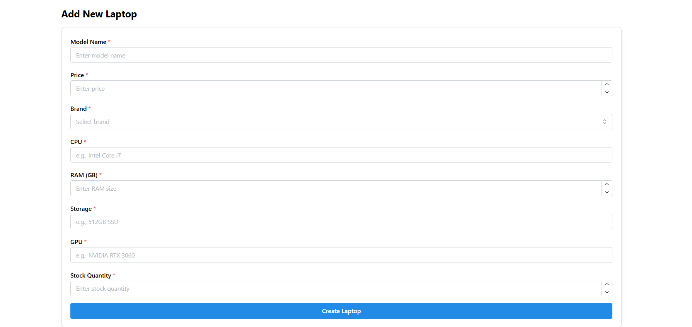
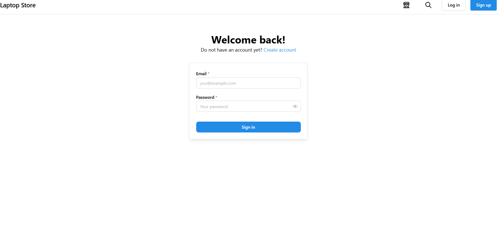
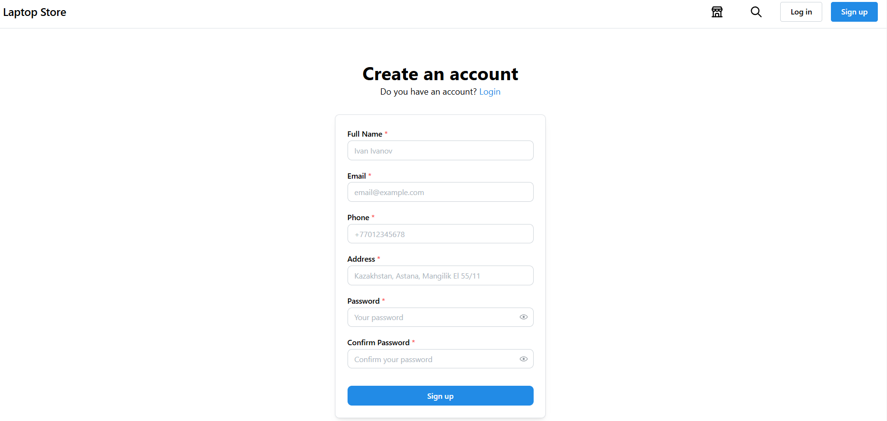

# Laptop Store

A full-stack e-commerce web application for buying and managing laptops. Built with React, TypeScript, Node.js, Express, and MongoDB.

## Table of Contents

- [Project Overview](#project-overview)
- [Features](#features)
- [Tech Stack](#tech-stack)
- [Requirements to boot](#prerequisites)
- [Setup Instructions](#setup-instructions)
  - [Backend Setup](#backend-setup)
  - [Frontend Setup](#frontend-setup)
- [API Documentation](#api-documentation)
  - [Authentication](#authentication)
  - [Laptops](#laptops)
  - [Orders](#orders)
  - [Reviews](#reviews)
  - [Users](#users)
  - [Brands](#brands)
- [Screenshots](#screenshots)
- [Project Structure](#project-structure)
- [Contributing](#contributing)

##  Project Overview

Laptop Store is a modern laptop store that enables users to browse, search, and purchase laptops online. The application features a user-friendly interface for customers and a comprehensive admin panel for managing inventory, orders, and brands.

### Key Capabilities:
- **Customer Portal**: Browse laptops, view detailed specifications, add to cart, place orders, and write reviews
- **Admin Panel**: Manage laptop inventory, brands, orders, and view statistics
- **Authentication**: Secure JWT-based authentication with role-based access control
- **Search & Filter**: Advanced filtering by brand, CPU, GPU, RAM, and price
- **Order Management**: Track orders from pending to delivered status

##  Features

### For Customers:
- User registration and authentication
- Search and filter laptops by specifications
- Shopping cart functionality
- Order placement and tracking
- Product reviews and ratings

### For Administrators:
- Add, update, and delete laptop inventory
- Manage brands
- View and update order status

##  Tech Stack

### Frontend:
- **React 19** - UI library
- **TypeScript** - Type safety
- **Vite** - Build tool and dev server
- **Mantine UI** - Component library
- **React Router** - Client-side routing
- **TanStack Query** - Data fetching and caching
- **Zustand** - State management
- **Axios** - HTTP client

### Backend:
- **Node.js** - Runtime environment
- **Express 5** - Web framework
- **MongoDB** - NoSQL database
- **Mongoose** - MongoDB ODM
- **JWT** - Authentication
- **bcryptjs** - Password hashing
- **Zod** - Schema validation
- **Nodemailer** - Email service

##  Requirements to boot

Before you begin, you have to install packages below:

- **Node.js** (v18 or higher)
- **npm**
- **MongoDB** (v5 or higher) - Running locally or a MongoDB Atlas account

##  Setup Instructions

### Backend Setup

1. **Navigate to the backend directory:**
   ```bash
   cd backend
   ```

2. **Install dependencies:**
   ```bash
   npm install
   ```

3. **Configure environment variables:**
   
   Create a `.env` file in the backend directory by copying `.env.example`:
   ```bash
   cp .env.example .env
   ```

   Update the `.env` file with your configuration:
   ```env
   MONGO_URI="mongo db url"
   FRONTEND_URL=http://localhost:5173
   PORT=5000
   SECRET_KEY="secret key"
   SMTP_HOST="smtp.gmail.com"
   SMTP_PORT="587"
   SMTP_USER="example@mail.com"
   SMTP_PASS="exapmlePassword"
   ```

4. **MongoDB:**
   
   Make account Mongo DB `https://www.mongodb.com/products/platform/atlas-database`
   Take addreess of data base and paste to `.env`

5. **Start the backend server:**

   For development (with auto-reload):
   ```bash
   npm run dev
   ```

   For production:
   ```bash
   npm start
   ```

   The backend will start on `http://localhost:5000`

### Frontend Setup

1. **Navigate to the frontend directory:**
   ```bash
   cd frontend
   ```

2. **Install dependencies:**
   ```bash
   npm install
   ```

3. **Configure environment variables:**
   
   Create a `.env` file in the frontend directory by copying `.env.example`:
   ```bash
   cp .env.example .env
   ```

   Update the `.env` file:
   ```env
   VITE_BACKEND_URL=http://localhost:5000
   VITE_FRONTEND_URL=http://localhost:5173
   ```

4. **Start the development server:**
   ```bash
   npm run dev
   ```

   The frontend will start on `http://localhost:5173`

5. **Build for production:**
   ```bash
   npm run build
   ```

   Preview the production build:
   ```bash
   npm run preview
   ```

##  API Documentation

Base URL: `http://localhost:5000/api`

### Authentication

#### Register User
```http
POST /api/auth/register
Content-Type: application/json

{
  "full_name": "Denis Li",
  "email": "you@example.com",
  "password": "password123",
  "phone": "+1234567890",
  "address": "Astana, Kazakhstan"
}
```

**Response (201 Created):**
```json
{
  "message": "User registered successfully"
}
```

#### Login
```http
POST /api/auth/login
Content-Type: application/json

{
  "email": "you@example.com",
  "password": "password123"
}
```

**Response (200 OK):**
```json
{
  "message": "Login successful",
  "token": "eyJhbGciOiJIUzI1NiIs...",
  "userID": "507f1f77bcf86cd799439011",
  "role": "customer"
}
```

#### Logout
```http
POST /api/auth/logout
```

**Response (200 OK):**
```json
{
  "message": "Logout successful"
}
```

#### Check Auth Status
```http
GET /api/auth/status
```

**Response (200 OK):**
```json
{
  "isLoggedIn": true,
  "userID": "507f1f77bcf86cd799439011",
  "role": "customer"
}
```

### Laptops

#### Get All Laptops (with filters)
```http
GET /api/laptops?brand=<brand_id>&cpu=<cpu_name>&gpu=<gpu_name>&ram=<ram_size>&minPrice=<min>&maxPrice=<max>&page=<page>&limit=<limit>
```

**Query Parameters:**
- `brand` - Filter by brand ID
- `cpu` - Filter by CPU name
- `gpu` - Filter by GPU name
- `ram` - Filter by RAM size (in GB)
- `minPrice` - Minimum price
- `maxPrice` - Maximum price
- `page` - Page number (default: 1)
- `limit` - Items per page (default: 10)

**Response (200 OK):**
```json
{
  "laptops": [
    {
      "_id": "507f1f77bcf86cd799439011",
      "model_name": "Dell XPS 15",
      "price": 1499.99,
      "specifications": {
        "cpu": "Intel Core i7-11800H",
        "ram": 16,
        "storage": "512GB SSD",
        "gpu": "NVIDIA RTX 3050"
      },
      "stock_quantity": 10,
      "brand_id": {
        "_id": "507f1f77bcf86cd799439012",
        "brand_name": "Dell",
        "country": "USA"
      }
    }
  ],
  "total": 50,
  "page": 1,
  "totalPages": 5
}
```

#### Get Laptop by ID
```http
GET /api/laptops/id/:id
```

**Response (200 OK):**
```json
{
  "_id": "507f1f77bcf86cd799439011",
  "model_name": "Dell XPS 15",
  "price": 1499.99,
  "specifications": {
    "cpu": "Intel Core i7-11800H",
    "ram": 16,
    "storage": "512GB SSD",
    "gpu": "NVIDIA RTX 3050"
  },
  "stock_quantity": 10,
  "brand_id": {
    "_id": "507f1f77bcf86cd799439012",
    "brand_name": "Dell",
    "country": "USA"
  }
}
```

#### Get Filter Parameters
```http
GET /api/laptops/filterParams
```

Returns available filter options (CPUs, GPUs, RAM sizes, brands).

**Response (200 OK):**
```json
{
  "cpus": ["Intel Core i7-11800H", "AMD Ryzen 7 5800H"],
  "gpus": ["NVIDIA RTX 3050", "AMD Radeon RX 6600M"],
  "rams": [8, 16, 32, 64],
  "brands": [
    {
      "_id": "507f1f77bcf86cd799439012",
      "brand_name": "Dell"
    }
  ]
}
```

#### Add Laptop (Admin Only)
```http
POST /api/laptops
Authorization: Bearer <token>
Content-Type: application/json

{
  "model_name": "Lenovo ThinkPad X1",
  "price": 1299.99,
  "specifications": {
    "cpu": "Intel Core i5-1135G7",
    "ram": 16,
    "storage": "512GB SSD",
    "gpu": "Intel Iris Xe"
  },
  "stock_quantity": 20,
  "brand_id": "507f1f77bcf86cd799439012"
}
```

**Response (201 Created):**
```json
{
  "_id": "507f1f77bcf86cd799439013",
  "model_name": "Lenovo ThinkPad X1",
  "price": 1299.99,
  ...
}
```

#### Update Laptop Stock (Admin Only)
```http
PATCH /api/laptops/:id/stock
Authorization: Bearer <token>
Content-Type: application/json

{
  "stock_quantity": 25
}
```

#### Delete Laptop (Admin Only)
```http
DELETE /api/laptops/:id
Authorization: Bearer <token>
```

### Orders

#### Create Order
```http
POST /api/orders
Authorization: Bearer <token>
Content-Type: application/json

{
  "items": [
    {
      "laptop_id": "507f1f77bcf86cd799439011",
      "quantity": 2,
      "unit_price": 1499.99
    }
  ],
  "total_price": 2999.98,
  "status": "pending"
}
```

**Response (201 Created):**
```json
{
  "_id": "507f1f77bcf86cd799439014",
  "user_id": "507f1f77bcf86cd799439010",
  "items": [...],
  "total_price": 2999.98,
  "status": "pending",
  "order_date": "2024-01-15T10:30:00.000Z"
}
```

#### Get User Orders
```http
GET /api/orders
Authorization: Bearer <token>
```

**Response (200 OK):**
```json
[
  {
    "_id": "507f1f77bcf86cd799439014",
    "user_id": "507f1f77bcf86cd799439010",
    "order_date": "2024-01-15T10:30:00.000Z",
    "status": "pending",
    "total_price": 2999.98,
    "items": [...]
  }
]
```

#### Get All Orders (Admin Only)
```http
GET /api/orders/all
Authorization: Bearer <token>
```

#### Update Order Status (Admin Only)
```http
PATCH /api/orders/:id/status
Authorization: Bearer <token>
Content-Type: application/json

{
  "status": "shipping"
}
```

Status options: `"pending"`, `"shipping"`, `"delievered"`

#### Refund Order Item
```http
PATCH /api/orders/:id/refund
Authorization: Bearer <token>
Content-Type: application/json

{
  "laptop_id": "507f1f77bcf86cd799439011"
}
```

### Reviews

#### Add Review
```http
POST /api/reviews
Authorization: Bearer <token>
Content-Type: application/json

{
  "laptop_id": "507f1f77bcf86cd799439011",
  "rating": 5,
  "comment": "Excellent laptop! Great performance."
}
```

**Response (201 Created):**
```json
{
  "_id": "507f1f77bcf86cd799439015",
  "user_id": "507f1f77bcf86cd799439010",
  "laptop_id": "507f1f77bcf86cd799439011",
  "rating": 5,
  "comment": "Excellent laptop! Great performance.",
  "created_at": "2024-01-15T10:30:00.000Z"
}
```

#### Get Reviews for Laptop
```http
GET /api/reviews/laptop/:laptopId
```

**Response (200 OK):**
```json
[
  {
    "_id": "507f1f77bcf86cd799439015",
    "user_id": {
      "_id": "507f1f77bcf86cd799439010",
      "full_name": "Yevgeniy Averyanov"
    },
    "laptop_id": "507f1f77bcf86cd799439011",
    "rating": 5,
    "comment": "Excellent laptop! Great performance.",
    "created_at": "2024-01-15T10:30:00.000Z"
  }
]
```

#### Delete Review
```http
DELETE /api/reviews/:id
Authorization: Bearer <token>
```

### Users

#### Get User by ID
```http
GET /api/users/:id
Authorization: Bearer <token>
```

**Response (200 OK):**
```json
{
  "_id": "507f1f77bcf86cd799439010",
  "full_name": "Yevgeniy Averyanov",
  "email": "yevgeniy@example.com",
  "phone": "+1234567890",
  "address": "Astana, Kazakhstan",
  "role": "customer",
  "created_at": "2026-02-09T00:00:00.000Z"
}
```

#### Get User Orders
```http
GET /api/users/:id/orders
Authorization: Bearer <token>
```

#### Get User Reviews
```http
GET /api/users/:id/reviews
Authorization: Bearer <token>
```

#### Update User Profile
```http
PATCH /api/users/:id
Authorization: Bearer <token>
Content-Type: application/json

{
  "full_name": "New name",
  "phone": "+1234567891",
  "address": "Astana, Kazakhstan"
}
```

### Brands

#### Get All Brands
```http
GET /api/brands
```

**Response (200 OK):**
```json
[
  {
    "_id": "507f1f77bcf86cd799439012",
    "brand_name": "Dell",
    "country": "USA"
  },
  {
    "_id": "507f1f77bcf86cd799439013",
    "brand_name": "HP",
    "country": "USA"
  }
]
```

#### Get Brand by ID
```http
GET /api/brands/:id
```

#### Get Brand Statistics
```http
GET /api/brands/stats/:id
```

Returns statistics about the brand including number of laptops, review score.

#### Add Brand (Admin Only)
```http
POST /api/brands
Authorization: Bearer <token>
Content-Type: application/json

{
  "brand_name": "Lenovo",
  "country": "China"
}
```

#### Delete Brand (Admin Only)
```http
DELETE /api/brands/:id
Authorization: Bearer <token>
```

##  Screenshots

### Home Page



The home page includes:
- Navigation bar with search functionality
- Featured laptop listings
- Access to brands and categories
- Login/Register options (if not logged in)

---

### Laptop Catalog with Filters


The catalog page includes:
- List of all laptops
- Filter (by brand, CPU, GPU, RAM, price range)
- Sort options (price, name, newest)
- Pagination for easy navigation
- Quick view of specifications and prices

---

### Laptop Detail Page



The detail page includes:
- Complete specifications (CPU, GPU, RAM, Storage)
- Price and stock availability
- Add to cart button
- Customer reviews and ratings

---

### Shopping Cart



The shopping cart includes:
- List of selected laptops
- Price calculations
- Total amount
- Proceed to checkout button
- Remove items option

---

### User Profile


The profile page shows:
- User information (name, email, phone, address)
- Order history
- Review history
- List of all orders
- Order status (pending, shipping, delivered)
- Request refund option
- Order date and total amount
---


### Admin Dashboard



The admin dashboard provides:
- Total sales overview
- Active orders count
- Inventory status
- Quick actions for management tasks

---

### Admin - Laptop Management



Laptop management features:
- Add new laptop form
- Update stock quantities
- Delete laptops
- View all laptop details

---

### Admin - Brand Management


Brand management includes:
- Add new brands
- View brand statistics
- Delete brands

---

### Login Page



Login page features:
- Email and password fields
- Link to registration page

---

### Registration Page



Registration form includes:
- Full name input
- Email validation
- Password strength requirements
- Phone number validation
- Address field
- Terms and conditions

---

##  Project Structure

```
laptop-store/
├── backend/
│   ├── src/
│   │   ├── config/          # Database and app configuration
│   │   ├── controller/      # Request handlers
│   │   │   └── dto/        # Data Transfer Objects
│   │   ├── middleware/      # Authentication & validation middleware
│   │   ├── model/          # Mongoose schemas
│   │   ├── routes/         # API routes
│   │   ├── services/       # Business logic
│   │   ├── utils/          # Utility functions
│   │   └── app.js          # Express app configuration
│   ├── server.js           # Server entry point
│   ├── package.json
│   └── .env.example
│
├── frontend/
│   ├── src/
│   │   ├── app/            # App configuration and routing
│   │   ├── components/     # Reusable UI components
│   │   ├── features/       # Feature-specific code
│   │   ├── pages/          # Page components
│   │   ├── shared/         # Shared utilities and types
│   │   └── main.tsx        # Application entry point
│   ├── index.html
│   ├── package.json
│   ├── vite.config.ts
│   └── .env.example
│
└── README.md
```


## 👥 Authors

- **CoffeeSi** Yevgeniy Averyanov - [GitHub](https://github.com/CoffeeSi)
- **fallendwn** Denis Li - [GitHub](https://github.com/fallendwn)
